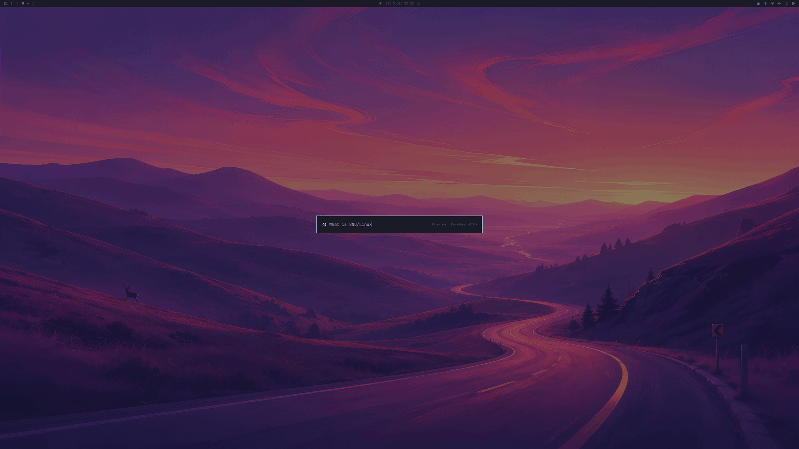
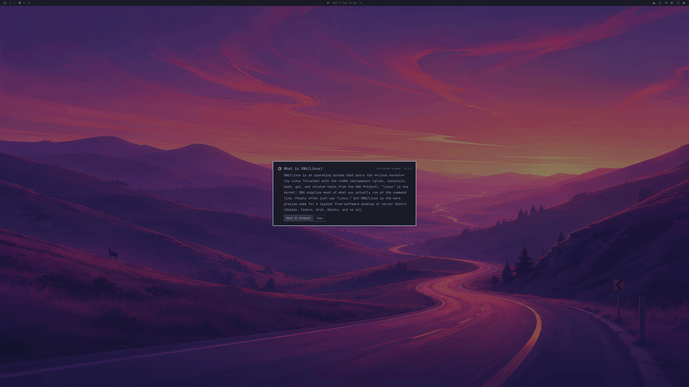

# omAsk

A centered [Omarchy](https://omarchy.org/) overlay for a quick question while you are already doing something else.

Type, read a short on-screen answer from the system default AI, and continue in the browser if you want the full chat.

Created by [Ali Shabdar](https://github.com/shabdar).

**Plugin id:** `omask` · **License:** MIT · **Version:** 1.0.0

Third-party plugins cannot use the reserved `omarchy.*` id namespace. The public id is `omask`; the GitHub repo is [`omarchy-ask`](https://github.com/shabdar/omarchy-ask). `omarchy plugin add` installs into `~/.config/omarchy/plugins/omask/` from the manifest id, not the repo name.





## Install

```bash
omarchy plugin add https://github.com/shabdar/omarchy-ask.git --enable --yes
```

Add a keybind in `~/.config/hypr/bindings.lua`:

```lua
o.bind("SUPER + Q", "omask", "omarchy-shell shell toggle omask '{}'")
```

`SUPER+Q` is free on a stock Omarchy bind set. `SUPER+SHIFT+A` is ChatGPT, `SUPER+SHIFT+ALT+A` is the Grok web app, `SUPER+SHIFT+CTRL+A` is the coding-agent picker.

Reload Hyprland after saving (`hyprctl reload`).

```bash
omarchy plugin update omask
omarchy plugin remove omask --yes
```

## Use

| Input | Action |
| --- | --- |
| Super+Q | Open / close |
| Enter | Ask the default agent |
| Ctrl+Enter or **Open in browser** | Continue in that agent's web chat |
| **Copy** | Copy the on-screen answer |
| Escape or click the dimmed desktop | Dismiss |

The logo and backend follow `omarchy default agent` (`~/.config/omarchy/defaults/agent`). Overlay answers run that agent's CLI (Grok, Claude, Gemini, Copilot, Codex, OpenCode, Crush, Pi, Oh My Pi). Agents without a consumer web chat still answer in the overlay; **Open in browser** stays disabled.

**Open in browser** starts a *new* web chat with the same question (`?q=`). It is not the CLI session. grok.com may show **Send this message?** — the helper confirms Send so the chat lands in History.

## How it works

```
Super+Q
  Overlay.qml          layer-shell card, keys, logo
    Enter
      ask.py           default-agent CLI → { ok, summary }
    Open in browser
      open_chat.py     agent web chat with ?q= in a new Chromium window
```

`keepLoaded` is on so the overlay stays in memory and Super+Q is instant. Edits under `~/.config/omarchy/plugins/omask/` hot-reload; if a change does not apply, run `omarchy restart shell`.

| File | Role |
| --- | --- |
| `manifest.json` | Plugin id `omask`, kind `overlay` |
| `Overlay.qml` | UI, IPC, runs the helpers |
| `AskModel.js` | Default-agent map and `ask.py` JSON parse |
| `ask.py` | Short answer from the default agent's CLI |
| `open_chat.py` | Browser handoff |
| `assets/` | Agent marks |

See [ARCHITECTURE.md](ARCHITECTURE.md) for the code map and how to extend it.

Logs: `~/.cache/omarchy/omask/open.log`

## Requirements

- Omarchy with `omarchy-shell`
- A default agent: `omarchy default agent <name>`
- Overlay answers: that agent's CLI on PATH (mise / `omarchy default agent` installs it)
- Browser handoff: Chromium, `wl-copy`, `wtype` (stock on Omarchy)

This is not the coding-agent TUI (`omarchy agent` / Super+Shift+Ctrl+A).

## IPC

```bash
omarchy-shell shell toggle omask '{}'
omarchy-shell shell summon omask '{}'
omarchy-shell shell hide omask
omarchy-shell shell summon omask '{"prompt":"Why is my bind not firing?"}'
```

## License

MIT. Copyright (c) 2026 Ali Shabdar.
